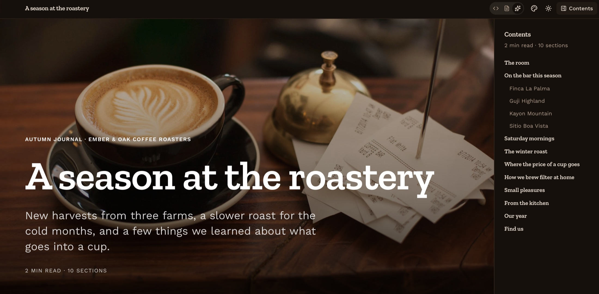

# stunning-md

Markdown in. A beautifully designed website out.

[](https://serrynaimo.github.io/stunning-md/?sample=roastery)

*[This markdown file](public/samples/roastery.md), rendered. [Open it live.](https://serrynaimo.github.io/stunning-md/?sample=roastery)*

`stunning-md` is a React component. Give it a markdown string and it lays the document out section by section — from its structure, the size of its images and the shape of its tables — then themes it to suit what it says. A small classifier model can be consulted for the judgement calls structure cannot settle; without one, rules decide everything.

**[Try the live demo](https://serrynaimo.github.io/stunning-md/)** with your own file or one of the samples.

## Install

```bash
npm i stunning-md
```

It needs React 19 or newer. It does not need Tailwind, shadcn/ui or any other setup in your app: the package ships its own stylesheet.

## Use it

Import the two stylesheets once, at the root of your app:

```tsx
// app/layout.tsx
import "stunning-md/styles.css"
import "katex/dist/katex.min.css" // maths; installed with stunning-md
```

Then render a document:

```tsx
// app/page.tsx — a Next.js server component
import { readFile } from "node:fs/promises"
import { StunningMarkdown } from "stunning-md"

export default async function Page() {
  const markdown = await readFile("content/report.md", "utf8")
  return <StunningMarkdown markdown={markdown} />
}
```

That is the whole integration. The component is a client component (the package marks it so), so it can be rendered straight from a server component as above, or from any client component in a Vite or other React app.

It is meant to be the page: it brings its own top bar, hero and full-width sections, so give it the full width of the window rather than a narrow column.

### Images with relative paths

URLs in the markdown are used as written. If your documents refer to images by relative path, map them to something the browser can load:

```tsx
"use client"
import { StunningMarkdown } from "stunning-md"

const resolveUrl = (url: string) => (/^(https?:|data:|blob:|\/)/.test(url) ? url : `/content/${url}`)

export function Document({ markdown }: { markdown: string }) {
  return <StunningMarkdown markdown={markdown} resolveUrl={resolveUrl} />
}
```

Functions cannot cross from a server component to a client one, so props such as `resolveUrl`, `classifier` and `onPlan` are passed from a small client component like this. Define them outside the component (or memoise them) so they keep the same identity between renders.

### Adding a classifier (optional)

A [jev-compatible](https://huggingface.co/AnkitAI/TinyJev-4B) classifier lets a model choose the theme, decide whether a table's numbers are worth charting, and judge whether a leading image should be the hero. The API key must stay on your server, so the browser talks to a route of yours that adds it:

```ts
// app/api/classify/route.ts
import { createClassifierHandler } from "stunning-md/server"

export const POST = createClassifierHandler({
  url: process.env.STUNNING_MD_CLASSIFIER_URL,
  apiKey: process.env.STUNNING_MD_CLASSIFIER_KEY,
})
```

```tsx
// app/document.tsx
"use client"
import { StunningMarkdown, createClassifier } from "stunning-md"

const classifier = createClassifier({ endpoint: "/api/classify" })

export function Document({ markdown }: { markdown: string }) {
  return <StunningMarkdown markdown={markdown} classifier={classifier} />
}
```

Any endpoint that accepts `{ state, questions }` with `choice`, `noul` and `score` question types and returns `{ answers }` will work, and `classifier` can be any function of the `Classify` type if you would rather call something else.

What is sent: the title, section headings and the first 400 characters of prose; up to eight tables (header and first twelve rows each); and the leading image's alt text, file name and dimensions. The full document is never sent.

### Adding chat (optional)

Give the component a chat function and the page takes requests. A floating input at the bottom sends them to any OpenAI-compatible chat model; each answer is laid out below as its own designed section of the page, in a theme chosen for it, while the conversation itself lives in the sidebar.

```ts
// app/api/chat/route.ts
import { createChatHandler } from "stunning-md/server"

export const POST = createChatHandler({
  url: process.env.STUNNING_MD_CHAT_URL, // the full …/chat/completions address
  model: process.env.STUNNING_MD_CHAT_MODEL,
  apiKey: process.env.STUNNING_MD_CHAT_KEY, // optional — a local model needs none
})
```

```tsx
"use client"
import { StunningMarkdown, createChat, createClassifier } from "stunning-md"

const chat = createChat({ endpoint: "/api/chat" })
const classifier = createClassifier({ endpoint: "/api/classify" })

export function Document({ markdown }: { markdown: string }) {
  return <StunningMarkdown markdown={markdown} chat={chat} classifier={classifier} />
}
```

`markdown` may be an empty string: the page then starts blank and fills as you ask.

A model's reply is sorted as it streams, block by block, into two kinds of text:

- **Content** — the thing that was asked for — is rendered on the page by the usual rules. It appears a section at a time, as each section is completed, so a section's layout is decided once and does not shift. Turns are set apart by a band of bare page, black or white with the mode.
- **Commentary** — the model talking about its answer ("Sure, here is…", "Let me know if…") — is shown briefly above the input, then fades. It stays in the sidebar, where the whole conversation is kept in order: your messages, the model's remarks, and, in place of each answer, a short list of the headings it put on the page, which jump to them.

Headings, lists, tables, code and images are always content. A plain paragraph is judged by where it sits and how it reads: remarks come at the start or the end of a reply and usually announce themselves. The classifier is asked about the unclear ones — on its own it is not a reliable judge of this, so it never overrules both position and wording. Without a classifier, the first paragraph of a reply is taken as commentary, and so is the last.

The open document and the conversation so far are sent to the chat model with each request. A button beside the input clears the page — document and conversation — to start again.

### Props

| Prop | Type | Default | |
| --- | --- | --- | --- |
| `markdown` | `string` | — | The document. |
| `classifier` | `Classify` | — | Answers judgement calls; omit for rules only. |
| `chat` | `Chat` | — | Lets the reader ask for content; answers are laid out on the page. |
| `theme` | `Partial<ThemeChoice>` | — | Fix `palette`, `fonts` or `formality` (corner style). |
| `appearance` | `"auto" \| "light" \| "dark"` | `"auto"` | `auto` follows the system setting. |
| `resolveUrl` | `(url: string) => string` | identity | Map URLs in the markdown to loadable ones. |
| `controls` | `boolean` | `true` | Show the view switch and the theme, layout and chart pickers. |
| `editable` | `boolean` | `false` | Let the reader edit the text in the markdown view. |
| `onMarkdownChange` | `(markdown: string) => void` | — | Called when the reader's edits are applied. |
| `onClear` | `() => void` | — | Called when the reader clears the page from the chat input. |
| `loadFonts` | `boolean` | `true` | Load the theme's typefaces from Google Fonts. |
| `settleMs` | `number` | `2500` | Longest wait for an image to report its size. |
| `maxWaitMs` | `number` | `8000` | Longest the loader waits for the classifier and fonts. |
| `className` | `string` | — | Added to the root element. |
| `onPlan` | `(plan, theme) => void` | — | Inspect the decisions that were made. |

A theme can also be set per document, in frontmatter: `theme: midnight`.

### Entry points

| Import | Contents | Runs |
| --- | --- | --- |
| `stunning-md` | `StunningMarkdown`, `createClassifier`, `createChat`, themes, and everything in `core` | In the browser |
| `stunning-md/core` | `parseMarkdown`, `planDocument`, table inference, `judgeDocument`, `sortReply`, theme data | Anywhere — no React |
| `stunning-md/server` | `createClassifierHandler`, `createChatHandler` | On the server |
| `stunning-md/styles.css` | All styles for the component | — |

The analysis is plain TypeScript and useful on its own:

```ts
import { parseMarkdown, planDocument } from "stunning-md/core"

const plan = planDocument({ ...parseMarkdown(source), images: { "cover.jpg": { width: 2400, height: 1350 } } })
plan.sections.map((s) => [s.titleText, s.layout, s.reason])
```

## What it does

| Content | Becomes |
| --- | --- |
| Leading `# Title`, short opening paragraphs | Hero with title and lead |
| Leading image, ≥ 1200 px wide and landscape | Full-bleed banner behind the title |
| Leading image that is small, square or an SVG | Logo above a centred title |
| Badge images (shields.io and similar) | A badge row in the hero |
| Section with very few words | "Statement": large, centred, extra room |
| Section with one image and some text | Side-by-side split, alternating sides |
| Section with one very large image and little text | Full-screen image with text over it |
| Section whose sub-headings are each a short blurb | Card grid |
| Three or more images in a row | Slideshow with captions and a lightbox |
| Short list (≤ 8 brief items) | Large type with drawn numerals or bullets |
| Long list | Ordinary body-text list |
| Short blockquote | Pull quote, with `— attribution` split out |
| `> [!NOTE]` and friends | Callouts |
| Table: periods × measures | Line, area or bar chart |
| Table: categories × one measure | Bar chart, donut (parts of a whole) or stat tiles |
| Table: dates × descriptions | Timeline |
| Table: short key–value pairs | Fact sheet |
| Any other table | A table, with horizontal scroll on small screens |
| Three or more titled sections | Sticky bar with reading progress and a contents list — pinned beside the page when it is at least 1400 px wide, in a slide-over menu otherwise |

Every chart keeps its data one click away: a small button opens the underlying table in a popover, and tables can be copied as tab-separated text for pasting into a spreadsheet.

The rest of markdown works as you would expect: GFM tables, task lists, strikethrough, autolinks and footnotes; fenced code with syntax highlighting and a copy button; `$inline$` and `$$block$$` maths; YAML frontmatter (`title`, `description`, `image`, `theme`, `author`, `date`, `category`). Raw HTML is never injected — images, links, line breaks and text are recovered from it and the rest is dropped.

A hero is only built when there is something to build it from: a title, or a leading image large or logo-like enough to carry one. A document that opens with plain paragraphs simply starts with its text.

Readers stay in control. A three-position switch in the top bar moves between the markdown text, a plain conventional rendering, and the designed page; with `editable`, the text can be changed there and is laid out afresh on switching back. A theme picker and light/dark switch sit beside it, each section has a `⋯` menu offering only the layouts its content can fill, and each chart can be switched between the forms its data supports. `controls={false}` hides all of these.

## How decisions are made

1. **Parse** — markdown to an mdast tree (`parseMarkdown`).
2. **Measure** — each image is loaded in the browser to learn its natural size. An image that cannot be measured is never promoted to a hero or full-screen layout.
3. **Plan** — `planDocument` turns tree + image sizes into a `DocumentPlan`. It is a pure function: the same input always gives the same plan, and every section records the `reason` for its layout.
4. **Judge** *(optional)* — `judgeDocument` asks the classifier a handful of questions and each answer is fed back into the plan as it lands:
   - which theme suits the content — each option tells the classifier what the theme is for, its key colours and its typeface;
   - whether a table's numbers are measurements to compare or reference values to look up;
   - whether rows are parts of a whole (donut) or independent (bar);
   - whether the leading image is fit to be the hero.

The document's own vocabulary counts as evidence too: when the classifier is torn between themes, keywords in the text settle it, but they cannot overturn a classifier that is sure. Without a classifier, the theme is chosen from those keywords alone.

While this happens the page shows a loader, with the document already laid out beneath it. Questions are asked top-down and all at once — nothing waits for scrolling. The loader lifts as soon as the theme and its fonts are in and no unanswered question concerns a block in the first two screens, so what the reader sees does not move; answers for tables further down are applied as they arrive. `maxWaitMs` caps the wait.

Chart forms follow a few fixed rules: one unit per axis (columns with different units or very different scales get separate charts), summary rows such as "Total" are left out of the plot, time runs left to right, and a handful of headline figures become stat tiles rather than a chart.

## Themes

There are 21 themes, each a complete look — light and dark colours, a typeface pairing and a corner style:

`paper` · `ink` · `ocean` · `forest` · `sunset` · `violet` · `terminal` · `chambers` · `academia` · `blueprint` · `midnight` · `rose` · `sand` · `citrus` · `crimson` · `slate` · `lagoon` · `plum` · `poster` · `espresso` · `console`

and 14 typeface pairings (`editorial`, `modern`, `technical`, `elegant`, `friendly`, `classic`, `scholarly`, `geometric`, `luxe`, `rounded`, `gazette`, `slab`, `poster`, `mono`), loaded from Google Fonts.

Charts follow the theme too:

- **Colours** — each theme's series colours are grown from its accent. The accent leads; every further colour is the candidate that stays furthest from those before it, at the accent's own intensity, so a muted theme gets muted charts and a vivid one vivid charts. Every palette must keep neighbouring series apart for readers with red-green colour-vision deficiency as well as full colour vision, sit inside a legible lightness band, and hold 3:1 contrast against the page — a unit test enforces this for all 21 themes in both modes.
- **Drawing style** — each theme names one of four chart styles: `linework` (monochrome ink with dashes and hatching, monospaced labels), `instrument` (rounded, saturated marks on a dotted grid), `soft` (gradients and depth) or `flat` (plain solid colour).

Themes are defined in `src/stunning-md/theme/themes.ts`. Each theme's `description` (what it is for) and `look` (its key colours), together with its typeface, are what the classifier reads when choosing, so adding a theme means adding one entry there. Keep those strings short: classifier latency grows with their total length.

Themes are applied as CSS variables scoped to the component, so the page around it is unaffected.

## The demo site

This repository is also the demo: a Next.js app that opens a markdown file — with its images, if you pick them together or choose the folder — and renders it.

```bash
git clone https://github.com/serrynaimo/stunning-md.git
cd stunning-md
npm install
cp .env.example .env.local   # optional: add a classifier address and key
npm run dev
```

Samples live in `public/samples/` and open directly with `?sample=annual-report`, `kyoto`, `readme`, `essay`, `after-dark` or `roastery`.

To try the chat, add `STUNNING_MD_CHAT_URL` and `STUNNING_MD_CHAT_MODEL` (and `STUNNING_MD_CHAT_KEY` if the provider needs one) to `.env.local`. Without a model to hand, `node scripts/mock-chat.mjs` runs a stand-in that streams canned answers at `http://localhost:3490/v1/chat/completions`. With chat available, the landing page also offers to start from a blank page.

If the server has no classifier or chat model configured, the landing page offers a form for the visitor's own — an endpoint and key for the classifier; an address, model name and optional key for chat. Those are checked with one test question, kept only in that browser's `localStorage`, and sent straight from the browser to the endpoint — never through this site's server. The endpoint therefore has to allow cross-origin requests.

### Hosting it on GitHub Pages

```bash
npm run build:static                                        # served from a domain root
NEXT_PUBLIC_BASE_PATH=/stunning-md npm run build:static     # served from a sub-path
```

The result is in `out/`. `.github/workflows/pages.yml` does this on every push to `main` and deploys it — enable Pages with "GitHub Actions" as the source and it works as is. A static host cannot run the classifier proxy, so the static build leaves that route out and never contains a key; visitors who want classifier judgements paste their own.

## Development

```
src/stunning-md/          the library
  index.ts · core.ts · server.ts     the package's entry points
  parse.ts                markdown → mdast, HTML clean-up, frontmatter
  analyze/                layout planning, table inference, image probing
  classifier.ts           questions, client, applying answers
  chat.ts                 chat client, and sorting a reply into commentary and content
  theme/                  palettes, typefaces, chart colours and styles
  components/             React rendering
  stunning.css            typography and layouts, scoped to .smd
  package.css             entry for the stylesheet shipped to npm
src/components/ui/        shadcn/ui components, bundled into the package
src/app/                  the demo site
tests/                    unit tests
scripts/                  browser checks used during development
```

```bash
npm test              # parsing, planning, table inference, classifier logic, theme and chart colours
npm run typecheck
npm run lint
npm run build         # the demo site
npm run build:lib     # the npm package, into dist/
```

The demo imports the library from source and styles it with its own Tailwind setup; the npm package is built separately by `build:lib`, which bundles the components with tsup and compiles the stylesheet with the Tailwind CLI so consumers need neither.

The files in `scripts/` drive a local Chrome through the samples while the dev server is running (`SMD_URL` overrides the default `http://localhost:3000`).

### Releasing to npm

```bash
npm login                      # once
npm version patch              # or minor / major; commits and tags
npm publish                    # runs typecheck, tests and build:lib first
git push --follow-tags
```

`npm pack --dry-run` shows exactly what would be published: `dist/`, this README, the licence and `package.json`.

## Built with

| | |
| --- | --- |
| [Next.js](https://nextjs.org) | The demo app and its static export |
| [shadcn/ui](https://ui.shadcn.com) | Menus, sheets, dialogs, popovers and buttons |
| [Generative Charts](https://generativecharts.com) | Tables drawn as charts |
| [KaTeX](https://katex.org) | Typeset mathematics |
| [remark](https://remark.js.org) | Markdown parsed into a syntax tree |
| [TinyJev](https://huggingface.co/AnkitAI/TinyJev-4B) | The classifier the demo was built against |

Also [lowlight](https://github.com/wooorm/lowlight) for syntax highlighting and [Embla Carousel](https://www.embla-carousel.com) for slideshows. Sample photographs are served by [Lorem Picsum](https://picsum.photos) from Unsplash.

## License

MIT
